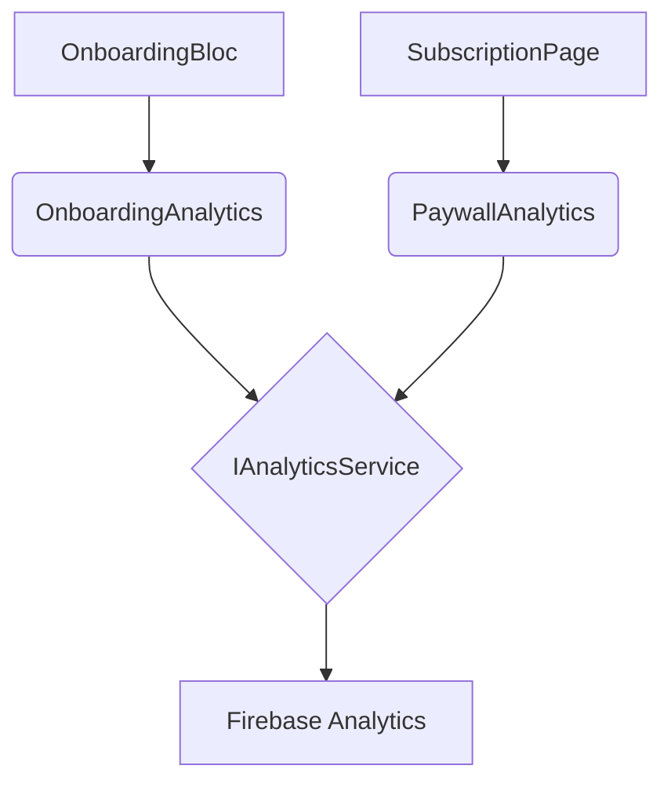

# Analytics Best Practices: Modular Feature Trackers

To maintain a scalable and clean codebase, Bizzie uses a modular **Feature Tracker** pattern for analytics. This prevents the core `AnalyticsService` from becoming a monolithic file and ensures feature-specific logging logic remains encapsulated within its respective feature module.

---

## 🏗️ Architecture

The analytics architecture consists of three layers:

1.  **Core Interface (`IAnalyticsService`)**: Defines the low-level primitive operations (e.g., `logEvent`, `setUserProperty`).
2.  **Core Implementation (`AnalyticsService`)**: Wraps the Firebase Analytics SDK.
3.  **Feature Trackers** (e.g., `OnboardingAnalytics`): Specialized classes that provide a clean, type-safe API for feature-specific events.

### The Dependency Rule
> [!IMPORTANT]
> Blocs and Views should **ONLY** depend on their specific **Feature Tracker**, never on the core `IAnalyticsService` directly.



---

## 🛠️ How to Add a New Event

### 1. Identify the Feature Module
Navigate to `lib/features/[feature_name]/presentation/analytics/`.

### 2. Update/Create the Tracker
Add a descriptive method to the tracker class. Ensure it uses the parameters defined in the Google Analytics event schema.

```dart
@injectable
class FeatureAnalytics {
  final IAnalyticsService _analytics;

  FeatureAnalytics(this._analytics);

  Future<void> logNewAction({required String detail}) async {
    await _analytics.logEvent(
      name: 'feature_action_performed',
      parameters: {'detail': detail},
    );
  }
}
```

### 3. Inject and Use
Dependency injection will handle providing the tracker to your BLoC or View.

```dart
// In BLoC
@injectable
class MyBloc extends Bloc {
  final FeatureAnalytics _analytics;

  MyBloc(this._analytics) : super(...) {
    on<ActionEvent>((event, emit) {
      _analytics.logNewAction(detail: event.detail);
    });
  }
}
```

---

## ✅ Checklist for New Analytics
- [ ] Tracker is registered with `@injectable`.
- [ ] Event names follow `snake_case`.
- [ ] No direct `IAnalyticsService` or `getIt<IAnalyticsService>()` calls in UI/Bloc code.
- [ ] Unit tests mock the Feature Tracker, not the core service.
- [ ] User property names do not exceed **24 characters**.
- [ ] Logic for calculating parameters (if complex) is encapsulated in the tracker.
