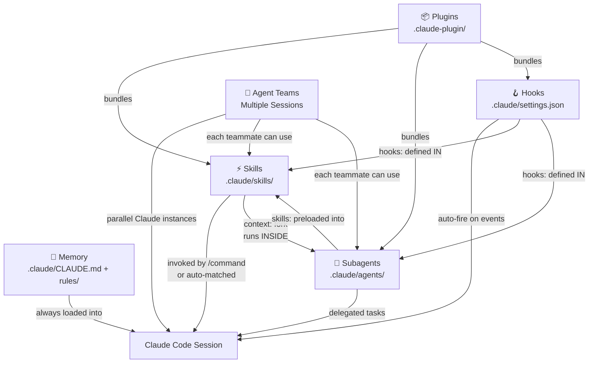

# Claude Code Capabilities Guide for Bizzie

## Phase 1 — Foundation (Complete ✅)

### What Was Created

```
Bizzie/
├── .claude/
│   ├── CLAUDE.md                     # Root project memory (always loaded)
│   └── rules/
│       ├── architecture-rules.md     # Clean Architecture standards
│       ├── best-practice-rules.md    # Flutter frontend best practices
│       └── technology-stack-rules.md # Tech stack source of truth
```

| File | Source | Changes |
|---|---|---|
| `CLAUDE.md` | **New** | Root memory: project identity, common commands, imports to rules |
| `architecture-rules.md` | `.agent/rules/architecture-rules.md` | Remove Gemini `trigger: always_on` frontmatter (Claude auto-loads all rules) |
| `best-practice-rules.md` | `.agent/rules/best-practice-rules.md` | Same |
| `technology-stack-rules.md` | `.agent/rules/technology-stack-rules.md` | Same |

---

## How All 6 Capabilities Work Together



### Interaction Summary

| Interaction | How It Works |
|---|---|
| **Skill → Subagent** | A skill with `context: fork` runs inside a subagent (isolated context). You can also specify `agent: Explore` to use a lightweight model. |
| **Subagent → Skills** | A subagent can preload skills via `skills:` frontmatter, giving it domain knowledge without repeating instructions. |
| **Hooks → Skills/Subagents** | Hooks can be defined *inside* a skill or subagent's YAML frontmatter (e.g., `PreToolUse` to lint before any Bash command). |
| **Hooks → Project-wide** | Hooks in `.claude/settings.json` fire globally (e.g., auto-format after every file edit). |
| **Agent Teams → Everything** | Each teammate is a full Claude session with access to all skills, subagents, and hooks. They coordinate via shared task lists. |
| **Plugins → Everything** | A plugin bundles skills + agents + hooks into a shareable, namespaced package. |

---

## Bizzie-Specific Examples

### 1. 🧠 Memory (Setting up now)

**What:** Persistent context loaded every session. No trigger needed — Claude reads it automatically.

**Bizzie example — `.claude/CLAUDE.md`:**
```markdown
# Bizzie — Flutter Finance App

## Common Commands
- Build: `flutter build apk --flavor dev`
- Test: `flutter test`
- Run code gen: `dart run build_runner build --delete-conflicting-outputs`
- Analyze: `flutter analyze`

## Architecture
This project uses Feature-Driven Clean Architecture.
See .claude/rules/ for detailed standards.
```

**Bizzie example — `.claude/rules/architecture-rules.md`:** *(path-specific rule)*
```yaml
---
paths:
  - "lib/features/**/*.dart"
---
```
This would make the architecture rules load *only* when working on feature files. For now, we'll keep these as **always-on** (no `paths:` frontmatter) since they're foundational.

---

### 2. ⚡ Skills (Future session)

**What:** Reusable instruction sets invoked via `/slash-commands`. The Claude equivalent of your `.agent/workflows/`.

**Bizzie example — `/build-feature` skill:**

```
.claude/skills/build-feature/SKILL.md
```
```markdown
---
name: build-feature
description: Scaffold a new feature following Clean Architecture
disable-model-invocation: true
argument-hint: [feature-name]
---

Scaffold the feature `$ARGUMENTS` following the Bizzie architecture:

1. Create directory structure:
   - `lib/features/$ARGUMENTS/data/dtos/`
   - `lib/features/$ARGUMENTS/data/datasources/`
   - `lib/features/$ARGUMENTS/data/repositories/`
   - `lib/features/$ARGUMENTS/domain/models/`
   - `lib/features/$ARGUMENTS/domain/interfaces/`
   - `lib/features/$ARGUMENTS/domain/usecases/`
   - `lib/features/$ARGUMENTS/presentation/bloc/`
   - `lib/features/$ARGUMENTS/presentation/views/`
   - `lib/features/$ARGUMENTS/presentation/widgets/`

2. Create barrel file: `lib/features/$ARGUMENTS/$ARGUMENTS.dart`

3. Register route in `lib/app/routes/app_routes.dart`

4. Verify: `flutter analyze`
```

**Usage:** `/build-feature portfolio`

---

### 3. 🤖 Subagents (Future session)

**What:** Specialized AI instances with restricted tools/models. The Claude equivalent of your `.agent` "agents" (MockBuilder, StateArchitect, etc).

**Bizzie example — Architecture Reviewer agent:**

```
.claude/agents/architecture-reviewer.md
```
```markdown
---
name: architecture-reviewer
description: Reviews code for Clean Architecture violations. Use after any feature changes.
tools: Read, Grep, Glob
model: sonnet
skills:
  - build-feature
memory: project
---

You are the Bizzie Architecture Reviewer. Your ONLY job is to verify:

1. **Dependency Rule**: Domain layer has NO imports from data/ or presentation/
2. **No direct data access**: presentation/ never imports from data/
3. **Route constants**: No hardcoded route strings
4. **BLoC purity**: No business logic in widgets
5. **Validators**: All validation uses `shared/utils/validators.dart`

Scan the specified files. Report violations as a checklist.
Do NOT make changes — report only.
```

**Usage:** `Use the architecture-reviewer to check lib/features/company_profile/`

**Skill ↔ Subagent interaction here:** The agent has `skills: build-feature` preloaded, so it knows the expected folder structure without re-reading it.

---

### 4. 🪝 Hooks (Future session)

**What:** Scripts that auto-fire on Claude lifecycle events. Think "CI checks that run inside your AI session."

**Bizzie example — Auto-analyze after file edits:**

`.claude/settings.json`:
```json
{
  "hooks": {
    "PostToolUse": [
      {
        "matcher": "Write|Edit",
        "hooks": [
          {
            "type": "command",
            "command": "dart analyze $(echo $TOOL_INPUT | jq -r '.file_path') 2>&1 | head -20",
            "timeout": 15
          }
        ]
      }
    ]
  }
}
```

**What happens:** Every time Claude writes or edits a `.dart` file, `dart analyze` runs automatically on that file and Claude sees the first 20 lines of output. If there are lint errors, Claude sees them *immediately*.

**Bizzie example — Hook inside a subagent:**
```markdown
---
name: safe-refactorer
description: Refactors code with automatic test verification
hooks:
  PostToolUse:
    - matcher: "Edit|Write"
      hooks:
        - type: command
          command: "flutter test --reporter compact 2>&1 | tail -5"
---
```

**Interaction:** This subagent has its *own* hook — after every edit it makes, tests run automatically. If tests fail, the subagent sees the output and can fix it before moving on.

---

### 5. 👥 Agent Teams (Future session)

**What:** Multiple Claude Code sessions working in parallel on different parts of the same project. Experimental (`CLAUDE_CODE_EXPERIMENTAL_AGENT_TEAMS=1`).

**Bizzie example prompt:**
```
Create an agent team to build the "portfolio" feature:
- Teammate 1 (StateArchitect): Build the domain + data layers (models, DTOs, 
  interfaces, repositories, usecases, BLoC)
- Teammate 2 (MockBuilder): Build the presentation layer (views, widgets) 
  using the architecture-reviewer subagent after each screen
- Teammate 3 (Tester): Write unit tests for the BLoC and integration tests 
  for the views

Each teammate should follow .claude/rules/ and use /build-feature as reference.
```

**How it connects to everything else:**
- Each teammate is a full Claude session → reads **Memory** (`.claude/CLAUDE.md` + rules)
- Each teammate can invoke **Skills** (e.g., teammate 2 uses `/build-feature`)
- Each teammate can delegate to **Subagents** (e.g., teammate 2 calls the `architecture-reviewer`)
- Each teammate's session fires **Hooks** (e.g., auto-analyze after edits)
- They coordinate via a **shared task list** and can message each other

---

### 6. 📦 Plugins (Future session)

**What:** A shareable, versioned bundle of skills + agents + hooks. Useful if you want the same setup across `Bizzie`, `bizzie_web`, and `bizzie_function_app`.

**Bizzie example — `bizzie-flutter-plugin`:**
```
bizzie-flutter-plugin/
├── .claude-plugin/
│   └── plugin.json          # { "name": "bizzie-flutter", "version": "1.0.0" }
├── skills/
│   ├── build-feature/
│   │   └── SKILL.md
│   ├── build-ui-from-figma/
│   │   └── SKILL.md
│   └── run-dep-ops/
│   │   └── SKILL.md
├── agents/
│   ├── architecture-reviewer.md
│   ├── state-architect.md
│   └── mock-builder.md
├── hooks/
│   └── hooks.json            # Auto-analyze, auto-test hooks
└── settings.json             # Default agent: architecture-reviewer
```

**Usage:** `claude --plugin-dir ~/plugins/bizzie-flutter-plugin`

Skills become `/bizzie-flutter:build-feature`, agents appear in `/agents`, hooks fire automatically.

---

## Documentation Links

- [Skills](https://code.claude.com/docs/en/skills)
- [Memory](https://code.claude.com/docs/en/memory)
- [Hooks](https://code.claude.com/docs/en/hooks)
- [Subagents](https://code.claude.com/docs/en/sub-agents)
- [Agent Teams](https://code.claude.com/docs/en/agent-teams)
- [Plugins](https://code.claude.com/docs/en/plugins)
